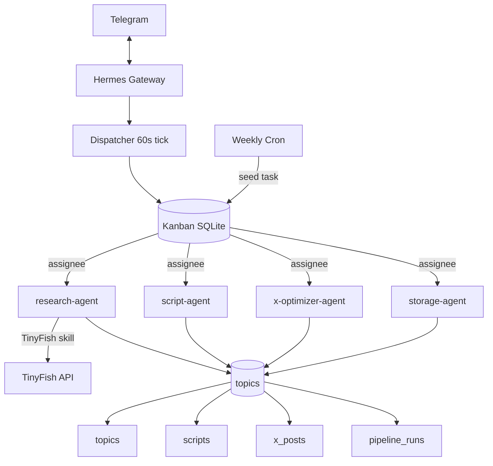

# 01 — Technical Architecture

Deep-dive companion to [PROJECT-OS.md](PROJECT-OS.md). Primary reference: [Derek Cheung tutorial](https://www.youtube.com/watch?v=2oKmF--xJAI).

---

## Architectural thesis

Hermes Kanban turns multi-agent coordination from fragile in-process delegation into a **durable task graph**. Each agent is a named profile with isolated context. The board is the only coordination channel besides Supabase (artifact handoff).

```
Agents do NOT share state.
They coordinate through:
  1. Kanban cards (who does what, when, status)
  2. Supabase tables (what was produced)
```

---

## Component diagram



---

## Hermes native capabilities used

| Capability | Usage in pipeline |
|------------|-------------------|
| Kanban board | Task graph, dependencies, parallel lanes |
| Gateway dispatcher | Auto-spawn workers, reclaim crashes |
| Agent profiles | Per-role model, tools, memory |
| Skills | Supabase agent, TinyFish use-tinyfish |
| Cron scheduler | Weekly Monday 07:00 orchestrator |
| Telegram gateway | Trigger, monitor, notifications |
| `kanban_*` tools | Workers read/complete tasks in-loop |

**Not used:** `delegate_task` swarms, custom orchestrator, external queue.

---

## Agent fleet (tutorial-faithful)

### research-agent

- **Kanban card:** Find trending YouTube/AI topics
- **Tools:** TinyFish skill (search primary, fetch for known URLs)
- **Output:** `topics` rows with `trending_score` 1–100
- **Tutorial example:** 15 topics saved; top = "AI agents for beginners — no-code build tutorials 2026" @ 95

### script-agent

- **Kanban card:** Turn top topic into video script
- **Input:** Highest `trending_score` in `topics`
- **Output:** `scripts.full_script` — cold open, seven steps, payoff, friction, outro
- **Runs after:** research card `done`

### x-optimizer-agent

- **Kanban card:** Rewrite for X reach
- **Input:** Latest `scripts` draft
- **Output:** `x_posts` — `main_post`, `thread` JSONB, `signals_applied` JSONB, `virality_score`
- **Rules:** See [09-x-algorithm-rules.md](09-x-algorithm-rules.md)

### storage-agent

- **Kanban card:** Coordinate Supabase writes across stages
- **Role:** Pipeline state in `pipeline_runs`; ensures cross-table consistency
- **Runs after:** x-optimize complete

---

## Kanban dependency model

Tutorial Step 7 explicit requirement:

> "Agents should not start downstream work until upstream tasks complete."

Implementation via Hermes native `blocked_by` / parent links:

```
research-agent task
    └── blocks → script-agent task
            └── blocks → x-optimizer-agent task
                    └── blocks → storage-agent task
```

Multi-topic runs: orchestrator (cron or manual prompt) creates per-topic child chains or batches script/x tasks after single research fan-out.

---

## Supabase as handoff layer

| Stage | Read table | Write table |
|-------|------------|-------------|
| Research | — | `topics` |
| Script | `topics` | `scripts` |
| X Optimize | `scripts` | `x_posts` |
| Storage | all | `pipeline_runs` + coordination |

`signals_applied` JSONB example shape:

```json
{
  "reply_weight": 27,
  "author_reply_weight": 150,
  "no_root_external_link": true,
  "link_placement": "first_reply",
  "early_velocity_target_replies_15min": 5,
  "algorithm_version": "phoenix-2026"
}
```

---

## Scheduling model

| Trigger | Mechanism | Behavior |
|---------|-----------|----------|
| Manual | Telegram message to Hermes | Creates/activates pipeline Kanban tasks |
| Weekly | Hermes cron "Monday 7:00 AM" | Cron-triggered orchestrator seeds run |
| Recovery | Dispatcher stale-claim reclaim | Crashed worker respawned |

No external cron service. Hermes gateway owns the schedule.

---

## Deployment architecture

### Railway (tutorial default)

- [Railway Hermes template](https://railway.com/deploy/hermes-agent)
- Volume `/data` → persistent Kanban DB, config, skills
- DeepSeek API key at deploy (or configure via web UI)
- Post-setup: remove public endpoint; operate via Telegram

### VPS (alternative)

- systemd `hermes gateway`
- `~/.hermes/kanban.db` on persistent disk
- Same profile/skill layout

---

## Security boundaries

| Asset | Exposure |
|-------|----------|
| `SUPABASE_SERVICE_ROLE_KEY` | Gateway env only; storage + write agents |
| `TINYFISH_API_KEY` | Research profile only |
| Kanban DB | Local to Hermes host |
| Telegram | Allowlisted user IDs |

RLS enforces per-agent table ownership even with service role.
