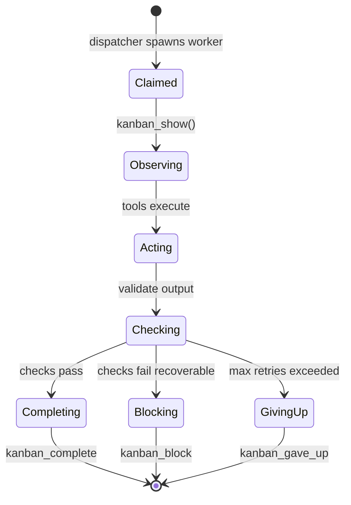
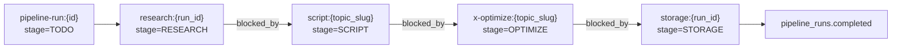
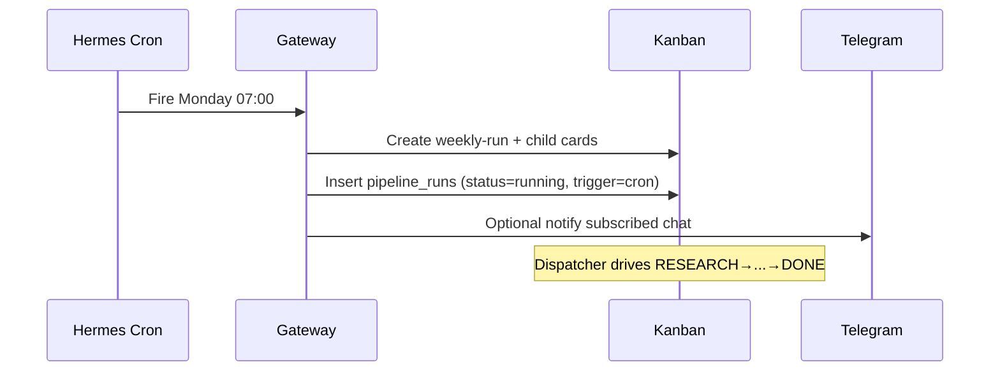
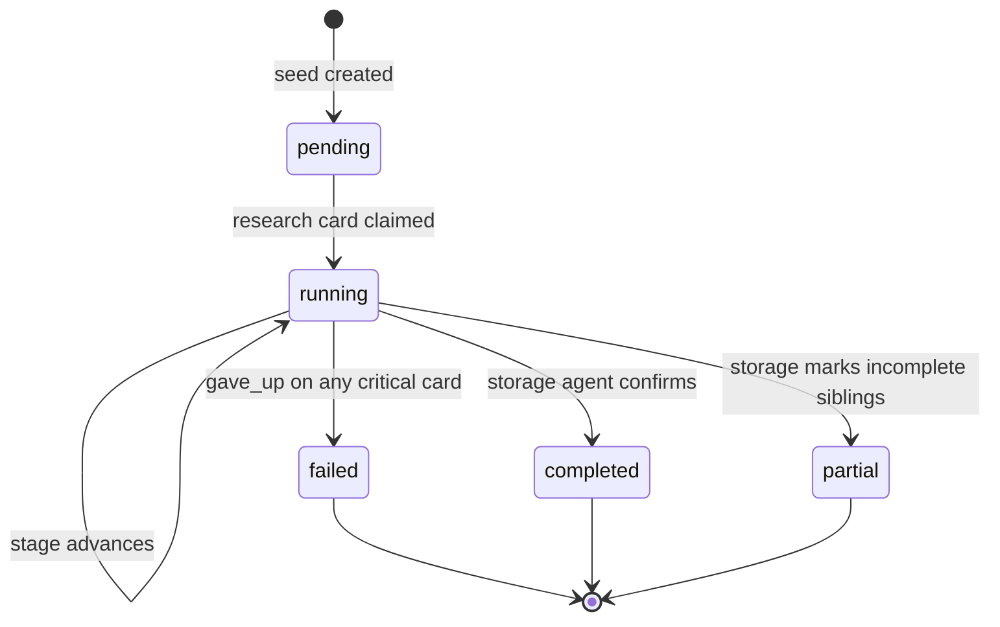

# Agent Operating System

**Hermes Kanban Multi-Agent Content Pipeline**

Step 2 deliverable. Builds on [PROJECT-OS.md](PROJECT-OS.md). Defines agent contracts, Kanban workflow, orchestration, scheduler, pipeline state, retry logic, and database ownership.

> No implementation code. No prompts. Contracts and operating rules only.

---

## Table of contents

1. [OS overview](#1-os-overview)
2. [Kanban workflow](#2-kanban-workflow)
3. [Orchestration design](#3-orchestration-design)
4. [Scheduler design](#4-scheduler-design)
5. [Pipeline state model](#5-pipeline-state-model)
6. [Retry logic](#6-retry-logic)
7. [Database ownership](#7-database-ownership)
8. [ResearchAgent](#8-researchagent)
9. [ScriptAgent](#9-scriptagent)
10. [XOptimizerAgent](#10-xoptimizeragent)
11. [StorageAgent](#11-storageagent)
12. [Event catalog](#12-event-catalog)
13. [Logging standards](#13-logging-standards)
14. [Permission matrix](#14-permission-matrix)

---

## 1. OS overview

### Operating model

```text
Goal → Observe (kanban_show + Supabase read) → Act (tools) → Check → Update state → kanban_complete | kanban_block
```

Four specialist agents. One Kanban board. One Supabase vault. Hermes gateway dispatcher is the only orchestrator — no custom workflow engine.

### Agent registry

| OS name | Hermes profile | Kanban assignee | Stage |
|---------|----------------|-----------------|-------|
| ResearchAgent | `research-agent` | `research-agent` | RESEARCH |
| ScriptAgent | `script-agent` | `script-agent` | SCRIPT |
| XOptimizerAgent | `x-optimizer-agent` | `x-optimizer-agent` | OPTIMIZE |
| StorageAgent | `storage-agent` | `storage-agent` | STORAGE |

### Coordination rules (inviolable)

1. Agents **never** message each other directly.
2. Agents **never** share in-process memory.
3. **Kanban** owns task lifecycle (who, when, status).
4. **Supabase** owns artifact handoff (what was produced).
5. Downstream agents **must not** start until upstream Kanban card is `done`.
6. Each agent writes **only** to tables it owns (RLS-enforced).

### Loop shared by all workers



---

## 2. Kanban workflow

### Pipeline stages (logical)

```text
TODO → RESEARCH → SCRIPT → OPTIMIZE → STORAGE → DONE
```

These are **stage labels** on cards and **Supabase `pipeline_runs.stage`** values — not separate Hermes boards.

### Stage ↔ Hermes status mapping

| Pipeline stage | Card in `todo` | Card `ready` | Card `in_progress` | Card terminal |
|----------------|----------------|--------------|-------------------|---------------|
| **TODO** | Seeded, deps unsatisfied | — | — | — |
| **RESEARCH** | Waiting for run start | Dispatcher can claim | research-agent working | `done` / `failed` |
| **SCRIPT** | blocked_by research | research `done` | script-agent working | `done` / `failed` |
| **OPTIMIZE** | blocked_by script | script `done` | x-optimizer working | `done` / `failed` |
| **STORAGE** | blocked_by optimize | optimize `done` | storage-agent working | `done` / `failed` |
| **DONE** | — | — | — | All stage cards `done`; `pipeline_runs.status = completed` |

### Full pipeline card graph (single topic)



### Multi-topic run (tutorial: top 2 of 5)

```text
pipeline-run:{id}
├── research:{id}                    [RESEARCH]  → 5 topics → topics table
├── script:{topic_a}                 [SCRIPT]    blocked_by research
├── script:{topic_b}                 [SCRIPT]    blocked_by research
├── x-optimize:{topic_a}             [OPTIMIZE]  blocked_by script:{topic_a}
├── x-optimize:{topic_b}             [OPTIMIZE]  blocked_by script:{topic_b}
└── storage:{id}                     [STORAGE]   blocked_by ALL x-optimize cards
```

Storage card uses **fan-in**: remains `todo` until every sibling optimize card is `done`.

### Card naming convention

| Pattern | Assignee | Stage tag |
|---------|----------|-----------|
| `pipeline-run:{uuid}` | *(none — container)* | TODO |
| `research:{run_id}` | research-agent | RESEARCH |
| `script:{topic_slug}` | script-agent | SCRIPT |
| `x-optimize:{topic_slug}` | x-optimizer-agent | OPTIMIZE |
| `storage:{run_id}` | storage-agent | STORAGE |
| `weekly-run:{YYYY-Www}` | *(cron seed)* | TODO |

### Kanban transitions (per card)

| From | To | Actor | Trigger |
|------|-----|-------|---------|
| `todo` | `ready` | Hermes Kanban | All `blocked_by` parents `done` |
| `ready` | `in_progress` | Dispatcher | Claims card; spawns assignee worker |
| `in_progress` | `done` | Worker | `kanban_complete --result "..."` |
| `in_progress` | `blocked` | Worker | `kanban_block --reason "..."` |
| `in_progress` | `crashed` | Dispatcher | Worker process died |
| `crashed` | `ready` | Dispatcher | Reclaim after timeout |
| `blocked` | `ready` | Human or worker | `kanban_unblock` after fix |
| `in_progress` | `gave_up` | Dispatcher | Circuit breaker / max retries |

### Column semantics (dashboard view)

| Dashboard column | Maps to |
|------------------|---------|
| To Do | `todo` (includes blocked-waiting) |
| Ready | `ready` |
| In Progress | `in_progress` |
| Done | `done` |
| Blocked | `blocked`, `gave_up`, `crashed` (filter) |

---

## 3. Orchestration design

### What orchestrates (and what does not)

| Component | Orchestrates? | Mechanism |
|-----------|---------------|-----------|
| Custom Python engine | **No** | Not built |
| Hermes gateway dispatcher | **Yes** | 60s tick: reclaim, promote, spawn |
| Hermes Kanban dependency engine | **Yes** | `blocked_by` auto-promote |
| Human via Telegram | **Yes (seed)** | Creates card graph + links |
| Hermes cron | **Yes (seed)** | Weekly root task creation |
| ResearchAgent | **No** | Worker only |
| ScriptAgent | **No** | Worker only |
| XOptimizerAgent | **No** | Worker only |
| StorageAgent | **No** | Worker only (finalizer) |

### Seeding flows

#### Manual (Telegram)

```text
Human message → default Hermes profile (or kanban-enabled profile)
    → kanban_create pipeline-run:{id}
    → kanban_create research:{id} --assignee research-agent --parent ...
    → kanban_link blocked_by for script, x-optimize, storage chain
    → Dispatcher takes over
```

#### Weekly cron

```text
Hermes cron (Mon 07:00 TZ) → cron profile session
    → kanban_create weekly-run:{YYYY-Www}
    → same child graph as manual
    → pipeline_runs.trigger = 'cron'
```

### Dispatcher contract

The dispatcher is **not configurable** in this project. Agents must conform to Hermes worker lifecycle:

1. Worker receives `_KANBAN_TASK` env var.
2. First action: `kanban_show()`.
3. Periodic: `kanban_heartbeat()` on runs >5 min.
4. Terminal: `kanban_complete` | `kanban_block` | natural exit → crash reclaim.

### Fan-in / fan-out rules

| Pattern | When | Rule |
|---------|------|------|
| **Fan-out** | Multi-topic script/optimize | One research card → N script cards (one per selected topic) |
| **Fan-in** | Storage | Storage `blocked_by` = all x-optimize siblings for the run |
| **Serial** | Default single-topic | Strict chain R → S → X → ST |

### Orchestration invariants

- Exactly **one** active `pipeline_runs` row per `pipeline-run:{id}` Kanban root.
- No duplicate assignee+title cards in `ready` or `in_progress` for the same run+stage+topic.
- Storage agent is the **only** agent that may set `pipeline_runs.status = completed`.

---

## 4. Scheduler design

### Schedule definition

| Job | Cron | Timezone | Action |
|-----|------|----------|--------|
| `weekly-content-pipeline` | `0 7 * * 1` | Operator-configured (e.g. `America/New_York`) | Seed `weekly-run:{YYYY-Www}` card graph |

Configured in Hermes via natural language or `hermes schedule` — no external cron.

### Scheduler behavior



### Scheduler rules

| Rule | Value |
|------|-------|
| Overlap policy | **Skip** if prior weekly run still `running` (storage incomplete) |
| Missed run | **No catch-up** — wait until next Monday |
| Dry-run | Use `*/5 * * * *` in staging only; revert before production |
| Idempotency key | `weekly-run:{ISO week}` — duplicate seed rejected |

### Scheduler observability

| Signal | Location |
|--------|----------|
| Cron fired | Hermes gateway logs |
| Run started | `pipeline_runs` row + `task_events.created` |
| Run completed | `pipeline_runs.completed_at` + Telegram notifier |

---

## 5. Pipeline state model

### State stores

| Store | Holds | Authority |
|-------|-------|-----------|
| Kanban SQLite | Task status, deps, comments, events | Hermes |
| `pipeline_runs` | Run-level status, stage, counts | StorageAgent (write), all (read) |
| `topics` / `scripts` / `x_posts` | Stage artifacts | Stage owner agents |

### `pipeline_runs` state machine



### `pipeline_runs` fields (operational)

| Field | Type | Set by | Purpose |
|-------|------|--------|---------|
| `id` | uuid | Seeder | Run identity |
| `trigger` | enum | Seeder | `manual` \| `cron` |
| `status` | enum | StorageAgent | `pending` \| `running` \| `completed` \| `failed` \| `partial` |
| `stage` | enum | Each agent on complete | Latest pipeline stage reached |
| `kanban_root_task_id` | text | Seeder | Link to Hermes root card |
| `topics_researched` | int | StorageAgent | Count from `topics` |
| `topics_produced` | int | StorageAgent | Scripts completed |
| `packages_produced` | int | StorageAgent | x_posts completed |
| `error_summary` | text | StorageAgent | On `failed` / `partial` |
| `started_at` | timestamptz | ResearchAgent | First topic write |
| `completed_at` | timestamptz | StorageAgent | Final gate |

### Per-topic artifact state

Each topic progresses independently after research selection:

```text
discovered → scored → selected → scripted → optimized → stored
```

Tracked via FK chain: `topics` → `scripts` → `x_posts`, all linked to `pipeline_run_id`.

### Consistency model

- **Kanban leads timing** — a stage is "complete" when its card is `done`.
- **Supabase leads content** — downstream reads only rows with `created_at` before their `kanban_show` timestamp.
- **Storage reconciles** — final audit compares Kanban `done` cards vs Supabase row counts.

---

## 6. Retry logic

### Global retry policy (Hermes native)

| Layer | Mechanism | Default |
|-------|-----------|---------|
| Worker crash | Dispatcher reclaim → respawn | Automatic |
| Stale claim | Dispatcher reclaim | ~30 min (Hermes default) |
| Circuit breaker | `gave_up` after N failures | 3 attempts per card |
| Human unblock | `kanban_unblock` | Manual |

### Per-agent retry matrix

| Agent | Retryable failures | Max auto retries | Backoff | Escalation |
|-------|-------------------|------------------|---------|------------|
| ResearchAgent | TinyFish timeout, empty results | 3 | 30s, 60s, 120s | `kanban_block` → human |
| ScriptAgent | Supabase read miss, empty topic | 2 | 60s | `kanban_block` if no topics |
| XOptimizerAgent | Script missing, validation fail | 2 | 60s | `kanban_block` with reason |
| StorageAgent | Supabase write conflict, count mismatch | 3 | 30s | `kanban_block`; run stays `running` |

### Retry decision tree (worker)

```text
on failure:
  if transient (timeout, 5xx, rate limit):
    if attempt < max_retries:
      kanban_comment("retry {n}/{max}: {reason}")
      exit → dispatcher reclaims → respawn
    else:
      kanban_block("{reason}")
  if permanent (RLS deny, no upstream data, invalid schema):
    kanban_block("{reason}")  # no auto retry
  if unknown:
    kanban_comment("unexpected: {reason}")
    exit → crash reclaim (counts as retry)
```

### Non-retryable conditions (all agents)

- RLS policy violation
- Missing `pipeline_run_id` on card metadata
- Upstream Kanban card not `done` (should not happen — guard in `kanban_show`)
- Malformed `signals_applied` / required JSONB schema

### Partial run handling

If 2-topic run: 1 optimize succeeds, 1 `gave_up`:

- StorageAgent sets `pipeline_runs.status = partial`
- `error_summary` names failed topic slug
- Successful artifacts remain in Supabase (no rollback)

---

## 7. Database ownership

### Table ownership matrix

| Table | Owner agent | SELECT | INSERT | UPDATE | DELETE |
|-------|-------------|--------|--------|--------|--------|
| `topics` | ResearchAgent | All agents | ResearchAgent | ResearchAgent | **Forbidden** |
| `scripts` | ScriptAgent | Script, XOpt, Storage | ScriptAgent | ScriptAgent | **Forbidden** |
| `x_posts` | XOptimizerAgent | XOpt, Storage | XOptimizerAgent | XOptimizerAgent | **Forbidden** |
| `pipeline_runs` | StorageAgent | All agents | Seeder, Storage | StorageAgent | **Forbidden** |

### Row-level conventions

| Table | Required FK | Idempotency key |
|-------|-------------|-----------------|
| `topics` | `pipeline_run_id` | `(pipeline_run_id, title)` unique |
| `scripts` | `topic_id` | `(topic_id)` one draft per topic per run |
| `x_posts` | `script_id` | `(script_id)` one package per script |
| `pipeline_runs` | — | `(kanban_root_task_id)` unique |

### Cross-agent read rules

| Agent | May read | Must not read for write |
|-------|----------|-------------------------|
| ResearchAgent | `pipeline_runs` (own run id) | scripts, x_posts |
| ScriptAgent | `topics`, `pipeline_runs` | x_posts |
| XOptimizerAgent | `scripts`, `topics` (context), `pipeline_runs` | — |
| StorageAgent | **All tables** | — (reconciliation only) |

### StorageAgent coordination duties

1. Create/update `pipeline_runs` at run start (if not seeded).
2. On each stage completion: verify expected row exists.
3. On final card: set `status`, `completed_at`, counts.
4. Emit reconciliation comment on Kanban root card.
5. **Never** mutate `topics`, `scripts`, `x_posts` content — only `pipeline_runs` and optional metadata patches explicitly defined in runbook.

---

## 8. ResearchAgent

**Profile:** `research-agent`

### Mission

Discover trending AI automation topics for non-technical audiences using live web search, score each for content virality potential, and persist ranked topics to Supabase.

### Responsibilities

- Execute TinyFish search queries aligned with run brief
- Fetch supplemental content for top candidates when needed
- Score topics 1–100 based on evidence from search results (not invention)
- Insert rows into `topics` with `source_urls` citations
- Mark Kanban research card `done` with summary result line
- Update `pipeline_runs.started_at` on first successful write

### Inputs

| Input | Source | Required |
|-------|--------|----------|
| Kanban task body | `kanban_show()` | Yes |
| `pipeline_run_id` | Card metadata / parent card | Yes |
| Topic count target | Task body (default: 5) | Yes |
| Audience filter | Task body (default: non-technical) | No |
| Search queries | Task body or skill defaults | Yes |

### Outputs

| Output | Destination |
|--------|-------------|
| `topics` rows (≥ target count) | Supabase |
| `kanban_complete --result` | Kanban (first line = top topic + score) |
| `kanban_comment` | Kanban (per-query progress) |
| `task_events.completed` | Hermes → Telegram notifier |

### Memory

| Type | Scope | Retention |
|------|-------|-----------|
| Hermes profile memory | Search query patterns, domain prefs | Persistent across runs |
| Session context | Current task only | Discarded on complete |
| Supabase | **Not** agent memory — artifact store only | — |

Memory must **not** be used as source of truth for topic data — only `topics` table.

### Context

Loaded at worker spawn:

```text
_KANBAN_TASK id
kanban_show → title, body, parent, metadata
pipeline_run_id
skills/use-tinyfish → search vs fetch rules
```

Context budget priority: task body > skill rules > profile memory.

### Prompt scope

**In scope:**

- TinyFish search/fetch execution
- Topic extraction from search results
- Virality scoring with cited evidence
- Supabase `topics` insert
- Kanban status updates

**Out of scope:**

- Writing scripts or X posts
- Selecting final production topics (ScriptAgent reads scores)
- Modifying `pipeline_runs` except `started_at`
- Creating downstream Kanban cards
- External publishing

### Tools

| Tool | Purpose |
|------|---------|
| `kanban_show` | Read assigned task |
| `kanban_complete` | Mark research done |
| `kanban_block` | Escalate unrecoverable failure |
| `kanban_comment` | Progress + retry notes |
| `kanban_heartbeat` | Long search runs |
| TinyFish `search` | Discover trending topics |
| TinyFish `fetch_content` | Extract page detail for scoring |
| Supabase skill | `topics` INSERT |

### Permissions

| Allowed (autonomous) | Requires human | Forbidden |
|---------------------|------------------|-----------|
| TinyFish search/fetch | — | TinyFish `agent` / browser (unless task explicitly requests) |
| Insert `topics` | — | Update/delete `topics` |
| `kanban_complete` on own card | — | Complete other agents' cards |
| Set `pipeline_runs.started_at` | — | Set `pipeline_runs.status = completed` |

### Stop conditions

| Condition | Action |
|-----------|--------|
| ≥ target `topics` rows inserted with scores | `kanban_complete` |
| TinyFish returns usable results < target after max retries | `kanban_block` — insufficient research |
| Invalid `pipeline_run_id` | `kanban_block` — config error |
| RLS insert denied | `kanban_block` — no retry |
| Token/budget ceiling in task metadata | `kanban_block` |

### Retry strategy

See [§6](#6-retry-logic). Research-specific: retry TinyFish on 429/5xx/timeout up to 3 times with backoff.

### Failure handling

| Failure | Handling |
|---------|----------|
| Empty search results | Widen query per skill rules → retry |
| Duplicate topic title | Skip insert (idempotent key); continue |
| Partial results (< target) | Block if below minimum threshold (default: 3) |
| Worker crash | Dispatcher reclaim — idempotent inserts prevent dupes |

### Kanban transitions

```text
todo → ready → in_progress → done
                          └→ blocked (escalation)
                          └→ crashed → ready (reclaim)
```

### Dependencies

| Dependency | Type |
|------------|------|
| `pipeline-run:{id}` root exists | Parent card |
| TinyFish skill installed | Runtime |
| Supabase skill + RLS | Runtime |
| None upstream | First worker stage |

### Logging

| Log | Where |
|-----|-------|
| Query strings + result counts | `kanban_comment` |
| Top topic + score | `kanban_complete --result` first line |
| TinyFish errors | `kanban_comment` + worker stderr |
| Rows inserted | Supabase `topics.id` in comment |

### Events

| Event | Emitter |
|-------|---------|
| `task.claimed` | Dispatcher |
| `task.completed` | ResearchAgent |
| `task.blocked` | ResearchAgent |
| `task.crashed` | Dispatcher |
| `pipeline.stage.research.done` | StorageAgent (on reconcile) |
| `telegram.notify` | Gateway on `completed` |

---

## 9. ScriptAgent

**Profile:** `script-agent`

### Mission

Select the highest virality-scored topic(s) from the current pipeline run and produce a complete long-form video script structured for non-technical audiences.

### Responsibilities

- Read `topics` for the run ordered by `trending_score DESC`
- Select top N topics per task brief (default: 1; tutorial full run: 1 per script card)
- Write `full_script` with required structure sections
- Populate `structure` JSONB with section boundaries
- Set `scripts.status = draft`
- Complete script Kanban card per topic

### Inputs

| Input | Source | Required |
|-------|--------|----------|
| Kanban task | `kanban_show()` | Yes |
| `pipeline_run_id` | Card metadata | Yes |
| `topic_slug` or topic id | Card title suffix | Yes (multi-topic) |
| Ranked topics | Supabase `topics` | Yes |
| Research `done` | Kanban parent card | Yes (enforced by `blocked_by`) |

### Outputs

| Output | Destination |
|--------|-------------|
| `scripts` row per topic | Supabase |
| `kanban_complete --result` | Kanban (topic title + word count) |
| `pipeline_runs.stage` | `SCRIPT` (via StorageAgent reconcile or direct update if permitted) |

### Memory

| Type | Scope |
|------|-------|
| Profile memory | Voice, tone, channel style preferences |
| Session | Current script task only |

### Context

```text
kanban_show → topic_slug, pipeline_run_id
Supabase: SELECT * FROM topics WHERE pipeline_run_id = ? ORDER BY trending_score DESC
Supabase: confirm research parent card done (implicit via blocked_by)
paths/specs/long-form.md structure requirements (via skill/reference)
```

### Prompt scope

**In scope:**

- Topic selection from Supabase scores
- Long-form script authoring (cold open → outro)
- `scripts` table write
- Own Kanban card completion

**Out of scope:**

- New web research (defer to ResearchAgent)
- X optimization
- Changing `topics.trending_score`
- Publishing

### Tools

| Tool | Purpose |
|------|---------|
| `kanban_show`, `kanban_complete`, `kanban_block`, `kanban_comment` | Task lifecycle |
| Supabase skill | `topics` SELECT, `scripts` INSERT/UPDATE |

### Permissions

| Allowed | Forbidden |
|---------|-----------|
| Read `topics` | Insert/update `topics` |
| Insert/update `scripts` for assigned topic | Delete `scripts` |
| Complete own script card | Complete research/optimize cards |

### Stop conditions

| Condition | Action |
|-----------|--------|
| Script meets structure + min word count | `kanban_complete` |
| No topics for run | `kanban_block` |
| Topic slug not in `topics` | `kanban_block` |
| Upstream research card not `done` | Must not run (Kanban gate) |

### Retry strategy

2 retries on Supabase read timeout. No retry on empty topics.

### Failure handling

| Failure | Handling |
|---------|----------|
| Ambiguous top tie | Pick highest `trending_score`; tie-break by `created_at` |
| Script too short | Regenerate once; then block |
| Crash mid-write | Reclaim; upsert on `(topic_id)` idempotency |

### Kanban transitions

Same as ResearchAgent. Stage tag: **SCRIPT**.

### Dependencies

| Dependency | Type |
|------------|------|
| `research:{run_id}` card `done` | `blocked_by` |
| `topics` rows exist | Supabase |
| One card per `script:{topic_slug}` | Graph |

### Logging

| Log | Where |
|-----|-------|
| Selected topic id + score | `kanban_comment` |
| Word count | `kanban_complete --result` |
| Section checklist | `structure` JSONB |

### Events

| Event | Emitter |
|-------|---------|
| `task.completed` | ScriptAgent |
| `artifact.script.created` | Implicit on Supabase insert |
| `telegram.notify` | Gateway |

---

## 10. XOptimizerAgent

**Profile:** `x-optimizer-agent`

### Mission

Transform the latest script draft into an X-native post and thread engineered for maximum engagement using documented Phoenix/open-source algorithm signals.

### Responsibilities

- Read latest `scripts` draft for assigned `topic_slug`
- Produce `main_post` (no external links in root)
- Produce `thread` JSONB array with link in **reply 1** only
- Populate `signals_applied` JSONB with weights used
- Score `virality_score` 1–100
- Set `suggested_post_time` within allowed windows

### Inputs

| Input | Source | Required |
|-------|--------|----------|
| Kanban task | `kanban_show()` | Yes |
| `script_id` / topic slug | Card metadata | Yes |
| Script draft | Supabase `scripts` | Yes |
| Algorithm rules | `docs/09-x-algorithm-rules.md` / skill | Yes |
| Script card `done` | Kanban `blocked_by` | Yes |

### Outputs

| Output | Destination |
|--------|-------------|
| `x_posts` row | Supabase |
| `kanban_complete --result` | Kanban (virality_score + post preview) |

### Memory

| Type | Scope |
|------|-------|
| Profile memory | Hook patterns, audience voice on X |
| Session | Current optimization task |

### Context

```text
kanban_show → topic_slug
Supabase: scripts JOIN topics for run context
Algorithm signal reference (reply 27x, author-reply 150x, no root link, velocity target)
```

### Prompt scope

**In scope:**

- X post + thread rewrite
- Algorithm signal application
- `signals_applied` documentation
- Engagement-oriented hooks and reply bait

**Out of scope:**

- Script re-research or full rewrite of long-form content
- Auto-posting to X API
- Modifying `scripts` body (read-only)
- External links in root post

### Tools

| Tool | Purpose |
|------|---------|
| Kanban lifecycle tools | Task management |
| Supabase skill | `scripts` SELECT, `x_posts` INSERT/UPDATE |

### Permissions

| Allowed | Forbidden |
|---------|-----------|
| Read `scripts`, `topics` | Write `scripts` |
| Insert/update `x_posts` | Delete `x_posts` |
| Reference x-algorithm repo rules | Live X API posting |

### Stop conditions

| Condition | Action |
|-----------|--------|
| Valid `x_posts` row passing schema checks | `kanban_complete` |
| `signals_applied` complete | Required for complete |
| No root URL in `main_post` | Validation gate |
| Script missing | `kanban_block` |

### Retry strategy

2 retries on validation failure (e.g. link detected in root). Auto-regenerate once.

### Failure handling

| Failure | Handling |
|---------|----------|
| Link in root post | Strip and regenerate; block after 2 fails |
| Thread > char limit | Split in thread array; never truncate silently |
| Missing `signals_applied` key | Block — schema incomplete |

### Kanban transitions

Stage tag: **OPTIMIZE**.

### Dependencies

| Dependency | Type |
|------------|------|
| `script:{topic_slug}` `done` | `blocked_by` |
| `scripts` row for topic | Supabase |

### Logging

| Log | Where |
|-----|-------|
| `signals_applied` summary | `kanban_comment` |
| `virality_score` | `kanban_complete --result` |
| Thread post count | `x_posts.thread` length in comment |

### Events

| Event | Emitter |
|-------|---------|
| `task.completed` | XOptimizerAgent |
| `artifact.x_post.created` | Supabase insert |
| `validation.signals_applied.pass` | Worker self-check |

---

## 11. StorageAgent

**Profile:** `storage-agent`

### Mission

Finalize the pipeline run by reconciling Kanban completion state with Supabase artifact counts, setting authoritative `pipeline_runs` status, and confirming the run reached **DONE**.

### Responsibilities

- Verify all upstream stage cards for the run are `done` (or document partial)
- Count `topics`, `scripts`, `x_posts` for `pipeline_run_id`
- Set `pipeline_runs.status`, `completed_at`, counts, `error_summary`
- Update `pipeline_runs.stage = STORAGE` then terminal status
- Post reconciliation summary on root Kanban card
- Complete storage Kanban card last

### Inputs

| Input | Source | Required |
|-------|--------|----------|
| Kanban task | `kanban_show()` | Yes |
| `pipeline_run_id` | Card metadata | Yes |
| All x-optimize cards | Kanban siblings | Yes (fan-in) |
| All artifact tables | Supabase | Yes |

### Outputs

| Output | Destination |
|--------|-------------|
| Updated `pipeline_runs` | Supabase |
| `kanban_complete --result` | Kanban (run summary) |
| Reconciliation comment | Root `pipeline-run` card |
| `pipeline.stage.done` | Logical DONE state |

### Memory

| Type | Scope |
|------|-------|
| Profile memory | Reconciliation checklists |
| Session | Current run audit only |

### Context

```text
kanban_show → run_id
Kanban: list sibling cards for run (via parent/root)
Supabase: COUNT queries per table filtered by pipeline_run_id
Expected counts from run brief (e.g. 2 packages)
```

### Prompt scope

**In scope:**

- Cross-table reconciliation
- `pipeline_runs` status finalization
- Kanban summary comments
- Partial/failed run classification

**Out of scope:**

- Content generation or editing
- Modifying `topics`, `scripts`, `x_posts` body fields
- Creating new pipeline runs
- Deleting any rows

### Tools

| Tool | Purpose |
|------|---------|
| Kanban lifecycle tools | Task + comments on root card |
| `kanban_list` (if enabled) | Sibling status audit |
| Supabase skill | Read all tables; UPDATE `pipeline_runs` only |

### Permissions

| Allowed | Forbidden |
|---------|-----------|
| Read all tables | Write `topics`, `scripts`, `x_posts` content |
| Update `pipeline_runs` | Delete any row |
| Comment on root card | `kanban_complete` on other agents' cards |

### Stop conditions

| Condition | Action |
|-----------|--------|
| Counts match expected; all critical cards `done` | `status=completed`, `kanban_complete` |
| Partial success | `status=partial`, `kanban_complete` with summary |
| Critical card `gave_up` | `status=failed`, `kanban_complete` (run ends) |
| Unresolvable count mismatch | `kanban_block` |

### Retry strategy

3 retries on Supabase update conflict. Backoff 30s.

### Failure handling

| Failure | Handling |
|---------|----------|
| Missing x_post for script | Mark `partial`; list in `error_summary` |
| Extra rows (dupes) | Report in comment; do not delete |
| Storage crash before complete | Reclaim; idempotent status update |

### Kanban transitions

Stage tag: **STORAGE** → terminal **DONE** for the run.

```text
storage card: todo → ready → in_progress → done
pipeline-run: remains done after all children complete
```

### Dependencies

| Dependency | Type |
|------------|------|
| ALL `x-optimize:{slug}` cards `done` | `blocked_by` fan-in |
| `pipeline_runs` row exists | Supabase |

### Logging

| Log | Where |
|-----|-------|
| Count matrix (expected vs actual) | `kanban_comment` on root |
| Final status | `pipeline_runs` + `kanban_complete --result` |
| Failed topic slugs | `error_summary` |

### Events

| Event | Emitter |
|-------|---------|
| `pipeline.completed` | StorageAgent |
| `pipeline.partial` | StorageAgent |
| `pipeline.failed` | StorageAgent |
| `telegram.notify` | Gateway — full run summary |

---

## 12. Event catalog

### Hermes native events (`task_events`)

| Event | When | Subscriber |
|-------|------|------------|
| `created` | Card seeded | Dashboard, WS |
| `claimed` | Dispatcher spawns worker | Logs |
| `completed` | `kanban_complete` | **Telegram notifier** |
| `blocked` | `kanban_block` | Telegram |
| `crashed` | Worker died | Dispatcher reclaim |
| `gave_up` | Circuit breaker | Telegram |
| `unblocked` | Human fix | Dispatcher |

### Application events (logical — logged to Kanban comments + `pipeline_runs`)

| Event | Stage | Payload |
|-------|-------|---------|
| `pipeline.run.started` | RESEARCH | `run_id`, `trigger` |
| `pipeline.stage.research.done` | RESEARCH | `topics_count`, `top_score` |
| `pipeline.stage.script.done` | SCRIPT | `topic_slug`, `word_count` |
| `pipeline.stage.optimize.done` | OPTIMIZE | `topic_slug`, `virality_score` |
| `pipeline.stage.storage.done` | STORAGE | `status`, counts |
| `pipeline.run.completed` | DONE | `packages_produced` |
| `pipeline.run.partial` | DONE | `error_summary` |
| `pipeline.run.failed` | DONE | `failed_stage`, `reason` |

### Telegram notifications

| Trigger | Content |
|---------|---------|
| Any card `completed` | First line of `--result` |
| Storage `completed` | Full run summary |
| Any card `blocked` | Reason + task title |
| Weekly cron seed | "Weekly content run started: {YYYY-Www}" |

---

## 13. Logging standards

### Principle

**Kanban comments are the audit log.** Supabase rows are the artifact log. No separate logging service in v1.

### Required log points per agent

| Point | Format |
|-------|--------|
| Worker start | `kanban_comment("start: {stage} {task_id}")` |
| External call | `kanban_comment("tinyfish|supabase: {action} {status}")` |
| Retry | `kanban_comment("retry {n}/{max}: {reason}")` |
| Complete | `kanban_complete --result "{one-line summary}"` |
| Block | `kanban_block --reason "{actionable reason}"` |

### Result line conventions

| Agent | `--result` first line format |
|-------|------------------------------|
| ResearchAgent | `top: {title} score={n} topics={count}` |
| ScriptAgent | `script: {topic_slug} words={n}` |
| XOptimizerAgent | `x: {topic_slug} virality={n}` |
| StorageAgent | `run: {status} packages={n}/{expected}` |

### Retention

| Store | Retention |
|-------|-----------|
| Kanban `task_events` | Permanent (SQLite) |
| Kanban comments | Permanent |
| Supabase rows | Permanent (operator-managed) |
| Worker stderr | Railway/log drain — 7–30 days |

---

## 14. Permission matrix

| Action | Research | Script | X Opt | Storage | Human | Dispatcher |
|--------|----------|--------|-------|---------|-------|------------|
| TinyFish search | ✅ | ❌ | ❌ | ❌ | ❌ | ❌ |
| Insert `topics` | ✅ | ❌ | ❌ | ❌ | ❌ | ❌ |
| Read `topics` | ✅ | ✅ | ✅ | ✅ | ✅ | ❌ |
| Insert `scripts` | ❌ | ✅ | ❌ | ❌ | ❌ | ❌ |
| Read `scripts` | ❌ | ✅ | ✅ | ✅ | ✅ | ❌ |
| Insert `x_posts` | ❌ | ❌ | ✅ | ❌ | ❌ | ❌ |
| Update `pipeline_runs` | ⚠️ `started_at` only | ❌ | ❌ | ✅ | ❌ | ❌ |
| `kanban_complete` own card | ✅ | ✅ | ✅ | ✅ | ❌ | ❌ |
| `kanban_unblock` | ❌ | ❌ | ❌ | ❌ | ✅ | ❌ |
| Seed card graph | ❌ | ❌ | ❌ | ❌ | ✅ | ❌ |
| Spawn workers | ❌ | ❌ | ❌ | ❌ | ❌ | ✅ |
| Post to X | ❌ | ❌ | ❌ | ❌ | ❌ | ❌ |
| Delete DB rows | ❌ | ❌ | ❌ | ❌ | ⚠️ manual | ❌ |

---

## Appendix A — Stage progression checklist

Operator verifies after each milestone:

- [ ] **TODO** — Root + child cards exist; `pipeline_runs` row `pending|running`
- [ ] **RESEARCH** — `topics` ≥ target; research card `done`
- [ ] **SCRIPT** — `scripts` per selected topic; script cards `done`
- [ ] **OPTIMIZE** — `x_posts` with `signals_applied`; optimize cards `done`
- [ ] **STORAGE** — `pipeline_runs.status = completed|partial`; storage card `done`
- [ ] **DONE** — Telegram summary received; Supabase queryable

---

## Appendix B — Document map

| Need | Read |
|------|------|
| Project foundation | [PROJECT-OS.md](PROJECT-OS.md) |
| Agent contracts | This file |
| Kanban conventions | `docs/08-kanban-conventions.md` (Phase 2) |
| X algorithm rules | `docs/09-x-algorithm-rules.md` (Phase 2) |
| Supabase DDL | `supabase/migrations/` (Phase 2) |
| Implementation order | [AGENTS.md](../AGENTS.md) |

---

*End of Agent Operating System — Step 2 complete.*
