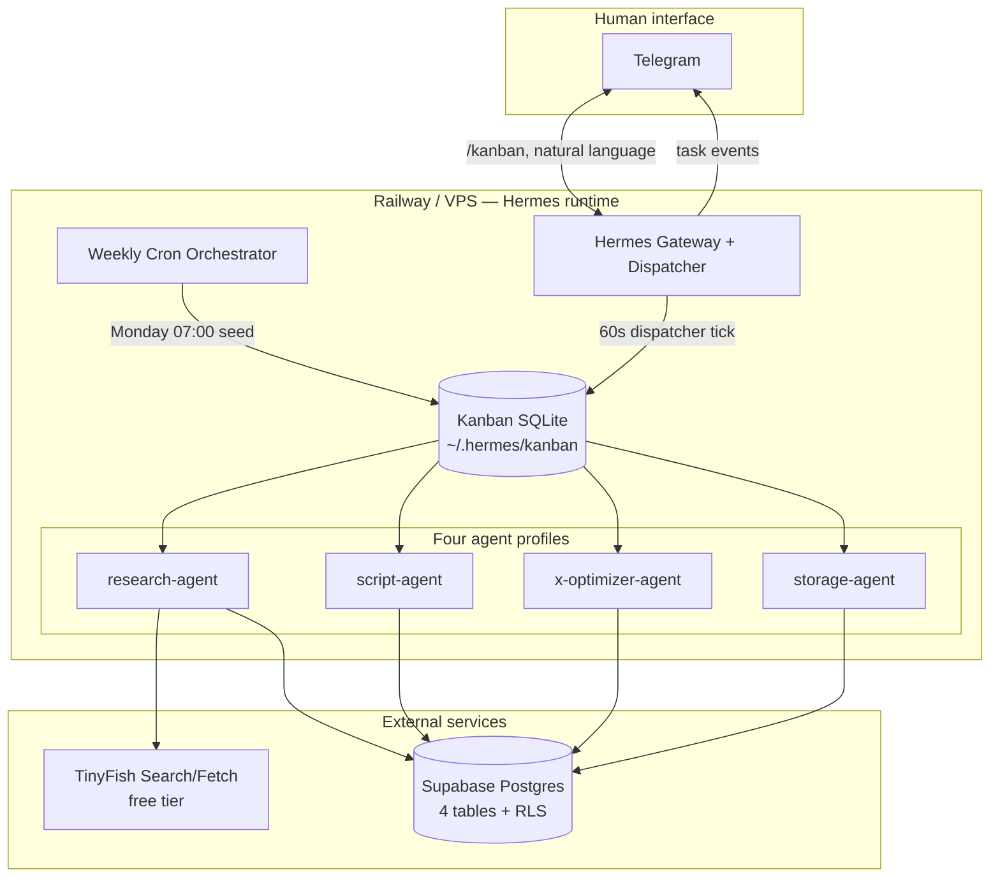

# Project Operating System

**Hermes Kanban Multi-Agent Content Pipeline**

Primary reference: [Derek Cheung tutorial](https://www.youtube.com/watch?v=2oKmF--xJAI) (Hermes v2026.5.7+)

This document is the single source of truth for project foundation. It contains all 15 required deliverables. No implementation code lives here.

---

## 1. Project Vision

### What we are building

An **AI-native content operating system** that reproduces the tutorial workflow: a coordinated team of four Hermes agent profiles — Research, Script, X Optimizer, and Storage — working in parallel where possible, sequencing where required, with the **Kanban board as the shared scoreboard** and **Supabase as the durable artifact store**.

### Why Kanban changes the game

Before Kanban, Hermes ran one agent at a time: prompt → work → done. That works for simple tasks but cannot sustain multi-step pipelines. Kanban enables:

- Multiple agents in parallel, each with own task, tools, and context
- Automatic task pickup and status updates via the gateway dispatcher
- Dependency gating (downstream waits for upstream completion)
- Full audit trail — nothing dropped, nothing run twice
- Crash recovery and self-healing reclaim

### Business outcome

Every Monday (or on demand via one Telegram message), the pipeline:

1. Researches trending AI automation topics via TinyFish (live web, not hallucinated)
2. Writes full video scripts for top-rated topics
3. Optimizes posts and threads using open-source X algorithm engagement weights
4. Persists everything to Supabase for editorial review and reuse

**Human role:** Trigger and review. Optional weekly cron runs with no human in the loop.

### Success definition

Open Supabase Monday morning → content week is planned: topics researched, scripts drafted, X packages optimized with `signals_applied` metadata.

### Design north star

> Not one agent doing everything. A coordinated team that replaces the project manager.

Each agent is excellent at one thing. Extend by adding profiles and Kanban cards — not by building a custom orchestrator.

---

## 2. Technical Architecture

### System context



### Coordination model (from tutorial)

| Mechanism | Role |
|-----------|------|
| **Kanban board** | Task assignment, status, dependencies, parallel lanes |
| **Supabase** | Shared artifact store — agents read upstream tables, write owned tables |
| **Hermes profiles** | Identity, model, toolsets, skills per agent |
| **Hermes skills** | Supabase agent skill, TinyFish skill — installed into Hermes, not custom code |
| **Gateway dispatcher** | Claims `ready` cards, spawns worker processes, reclaims crashes |

**Critical rule:** Agents do **not** share in-process state. They coordinate through the board **and** Supabase.

### Kanban task graph (full pipeline)

Tutorial step 7 pattern — one prompt, dependency-gated execution:

```
[pipeline-run:manual or weekly]
        │
        ▼
[research: find 5 topics]          assignee: research-agent
        │                          blocked_by: none
        ▼ (parent complete → promote)
[script: top N topics]             assignee: script-agent
        │                          blocked_by: research
        ▼
[x-optimize: algorithm rewrite]    assignee: x-optimizer-agent
        │                          blocked_by: script
        ▼
[storage: coordinate writes]       assignee: storage-agent
                                   blocked_by: x-optimize
```

For multi-topic runs (tutorial: top 2 topics), research fans out or script creates per-topic child cards — same dependency pattern.

### Agent responsibilities (faithful to video)

| Agent | Profile | Primary tools | Reads | Writes |
|-------|---------|---------------|-------|--------|
| **Research** | `research-agent` | TinyFish skill (search/fetch) | — | `topics` |
| **Script** | `script-agent` | Supabase skill | `topics` (top virality) | `scripts` |
| **X Optimizer** | `x-optimizer-agent` | Supabase skill, X algorithm knowledge | `scripts` (latest draft) | `x_posts` (+ `signals_applied` JSONB) |
| **Storage** | `storage-agent` | Supabase skill | all stages | `pipeline_runs`, cross-stage coordination |

Storage agent **coordinates Supabase writes across all stages** — not merely a final dump step.

### X algorithm integration (Phoenix 2026 / open-source signals)

Optimizer encodes publicly documented engagement weights:

| Signal | Weight / rule | Implementation note |
|--------|---------------|---------------------|
| Reply | 27× a like | Engineer posts for replies, not likes |
| Author reply to commenter | 150× | Thread design invites author follow-up |
| External links | Suppressed in root post since 2023 | Put link in **first reply**, not main post |
| Early velocity | Strong signal in first 30–60 min | Target 5+ replies in first 15 minutes |
| Post timing | 07:00–09:00 or 18:00–20:00 | Stored in `x_posts` metadata |

`signals_applied` JSONB column records which weights the optimizer applied per package.

### Data flow

```
TinyFish search → topics.trending_score, topics.title, topics.metadata
       ↓
topics (top by score) → scripts.full_script, scripts.structure
       ↓
scripts → x_posts.main_post, x_posts.thread, x_posts.signals_applied
       ↓
pipeline_runs.status, pipeline_runs.completed_at (storage agent)
```

### What we do NOT build

- Custom workflow engine or task queue
- Custom dispatcher (use gateway-embedded)
- Custom Kanban UI
- Agent-to-agent message bus
- REST API for pipeline control (Telegram + `/kanban` suffice)

---

## 3. Repository Structure

Monorepo for **project documentation, schema-as-code, deploy manifests, and skill install recipes**. Runtime state lives on the Hermes host (`~/.hermes/` or Railway `/data`).

```
hermes-content-pipeline/
├── README.md
├── AGENTS.md
├── PROJECT-OS.md              → symlink or pointer to docs/PROJECT-OS.md
├── docs/                        # All specifications
├── supabase/                    # Schema DDL + RLS (source of truth for DB)
├── deploy/                      # Railway + VPS manifests
├── skills/                      # Skill install manifests (not SKILL.md bodies)
├── profiles/                    # Hermes profile YAML fragments
├── schemas/                     # JSON Schema for Supabase row shapes
├── runbooks/                    # Step-by-step ops guides (video order)
├── .env.example                 # Documented env var catalog
└── tests/                       # Schema validation, config lint (no LLM)
```

**Not in repo:** Live Kanban DB, Hermes `~/.hermes` state, API keys, generated content.

---

## 4. Folder Structure

Detailed tree with file purposes:

```
hermes-content-pipeline/
│
├── docs/
│   ├── PROJECT-OS.md            # This file — master OS
│   ├── 01-architecture.md       # Architecture deep-dive
│   ├── 02-repository-layout.md  # Extended layout notes
│   ├── 03-development-phases.md # Video-ordered build phases
│   ├── 04-technical-roadmap.md  # Workstream roadmap
│   ├── 05-milestones.md         # Gates M0–M5
│   ├── 06-supabase-schema.md    # Table DDL spec + RLS matrix
│   ├── 07-agent-specs.md        # Per-agent behavior spec (no prompts)
│   ├── 08-kanban-conventions.md # Card naming, dependencies, assignees
│   ├── 09-x-algorithm-rules.md  # Signal weights reference
│   ├── 10-runbook.md            # Go-live checklist
│   └── 11-documentation-plan.md # Doc maintenance schedule
│
├── supabase/
│   ├── migrations/
│   │   └── 001_content_pipeline.sql   # topics, scripts, x_posts, pipeline_runs
│   ├── policies/
│   │   └── rls_agent_ownership.sql      # Per-agent write scopes
│   └── README.md                        # Setup via Supabase plug + SQL editor
│
├── deploy/
│   ├── railway/
│   │   ├── README.md            # Railway template deploy steps
│   │   └── volume-notes.md      # /data persistence for Kanban + config
│   └── vps/
│       ├── hermes-gateway.service
│       └── README.md
│
├── skills/
│   ├── INSTALL.md               # How to install Supabase + TinyFish skills
│   ├── supabase-agent.manifest.yaml
│   └── tinyfish.manifest.yaml
│
├── profiles/
│   ├── research-agent.yaml
│   ├── script-agent.yaml
│   ├── x-optimizer-agent.yaml
│   └── storage-agent.yaml
│
├── schemas/
│   ├── topic.json
│   ├── script.json
│   ├── x_post.json
│   └── pipeline_run.json
│
├── runbooks/
│   ├── 01-railway-deploy.md     # Video Step 1
│   ├── 02-kanban-team.md        # Video Step 2
│   ├── 03-supabase-schema.md    # Video Step 3
│   ├── 04-research-agent.md     # Video Step 4
│   ├── 05-script-agent.md       # Video Step 5
│   ├── 06-x-optimizer.md        # Video Step 6
│   ├── 07-full-pipeline.md      # Video Step 7
│   └── 08-weekly-cron.md        # Video bonus
│
├── tests/
│   ├── test_schema_sql.py       # Migration applies cleanly
│   └── test_profile_yaml.py     # Profile fragments valid
│
├── .env.example
├── .gitignore
└── SECURITY.md
```

### Hermes runtime layout (on host — not committed)

```
/data/  (Railway) or ~/.hermes/  (VPS)
├── config.yaml              # Providers, Telegram, MCP, cron
├── kanban/
│   └── kanban.db            # Or boards/<slug>/kanban.db
├── skills/                  # Installed: supabase-agent, use-tinyfish
└── state.db                 # Hermes session memory (separate from content)
```

---

## 5. Development Roadmap

Ordered to match the tutorial's demonstrated build sequence.

| Order | Workstream | Video step | Outcome |
|-------|------------|------------|---------|
| 1 | Railway / Hermes deploy | Step 1 | Gateway running, Kanban tab visible |
| 2 | Telegram + 4 profiles + Kanban cards | Step 2 | Four cards in `todo`, assignees set |
| 3 | Supabase project + skill + 4-table schema | Step 3 | Tables + RLS live |
| 4 | TinyFish skill + research agent config | Step 4 | Topics filling from live search |
| 5 | Script agent config | Step 5 | Scripts drafting from top topic |
| 6 | X optimizer + algorithm rules | Step 6 | x_posts with signals_applied |
| 7 | Full pipeline + dependencies | Step 7 | One prompt → end-to-end run |
| 8 | Weekly cron | Bonus | Monday 07:00 unattended run |
| 9 | Docs + schema-as-code + hardening | Post-tutorial | Reproducible from runbooks |

### Parallel tracks (after Step 1)

- **Track A:** Supabase schema + RLS (`supabase/`, `docs/06`)
- **Track B:** Profile YAML + skill install manifests (`profiles/`, `skills/`)
- **Track C:** Runbooks mirroring video (`runbooks/`)
- **Track D:** X algorithm rules doc (`docs/09`)

Integration gate: Step 7 requires A + B complete.

---

## 6. Milestones

| ID | Name | Target | Proof |
|----|------|--------|-------|
| **M0** | Project OS | Day 0 | All 15 deliverables in `docs/PROJECT-OS.md` |
| **M1** | Hermes live | Day 1 | Railway deploy, Kanban tab, Telegram responds |
| **M2** | Team on board | Day 2 | 4 Kanban cards, 4 profiles, dispatcher spawns workers |
| **M3** | Supabase wired | Day 3 | 4 tables, RLS, Supabase skill connected |
| **M4** | Research works | Day 4 | ≥5 topics from TinyFish with trending_score |
| **M5** | Script works | Day 5 | Full script in `scripts` for top topic |
| **M6** | X optimize works | Day 6 | x_posts row with thread + signals_applied |
| **M7** | Full pipeline | Day 7 | One Telegram prompt → 2 complete topic packages |
| **M8** | Weekly cron | Day 8 | Monday run fills Supabase without human |
| **M9** | Reproducible | Day 10 | Third party deploys from runbooks only |

---

## 7. Technology Stack

| Layer | Technology | Version / notes |
|-------|------------|-----------------|
| Agent runtime | [Hermes Agent](https://github.com/NousResearch/hermes-agent) | ≥ v2026.5.7 (Kanban feature) |
| Orchestration | Hermes native Kanban + gateway dispatcher | SQLite-backed, no alternative |
| Human interface | Telegram | Via Hermes gateway |
| Hosting | [Railway template](https://railway.com/deploy/hermes-agent) or VPS | Volume at `/data` |
| LLM provider | DeepSeek (tutorial default) | Any OpenAI-compatible provider via Hermes |
| Web research | [TinyFish](https://tinyfish.ai) Search + Fetch | Free tier |
| Content store | [Supabase](https://supabase.plug.dev/ykdVN09) Postgres | Free tier sufficient |
| X optimization | [x-algorithm](https://github.com/xai-org/x-algorithm) Phoenix signals | Reference weights, not live API |
| Scheduling | Hermes built-in cron | "Every Monday at 7:00 AM" |
| Skills | Hermes skill system | Supabase agent skill, TinyFish cookbook skill |

---

## 8. Dependencies

### Runtime (Hermes host)

| Dependency | Purpose | Install |
|------------|---------|---------|
| Hermes Agent | Gateway, Kanban, profiles, cron | Railway template or `pip install` |
| Python 3.11+ | Hermes runtime | Railway build |
| Node.js | Hermes build chain | Railway build |
| Persistent volume | Kanban DB, config, skills | Railway `/data` mount |

### External services

| Service | Purpose | Required |
|---------|---------|----------|
| LLM API (DeepSeek, OpenRouter, etc.) | Agent inference | Yes |
| Telegram Bot API | Human interface | Yes |
| TinyFish API | Web search/fetch | Yes (research) |
| Supabase project | Content persistence | Yes |
| Railway or VPS | 24/7 gateway | Yes |

### Hermes skills (installed at runtime)

| Skill | Source | Purpose |
|-------|--------|---------|
| Supabase agent skill | Install via Hermes conversation + project URL + service role key | DB read/write from agents |
| TinyFish skill | [tinyfish-cookbook](https://github.com/tinyfish-io/tinyfish-cookbook) `use-tinyfish` | Search vs fetch decision tree |

### Repository dev dependencies (schema validation only)

| Package | Purpose |
|---------|---------|
| `pyyaml` | Profile manifest lint |
| `jsonschema` | Row shape validation |
| `pytest` | Migration + config tests |

No application Python dependencies for pipeline logic — **the pipeline is Hermes + skills + Kanban**.

---

## 9. Environment Variables

Document in `.env.example`. Never commit values.

### Railway / Hermes gateway

| Variable | Required | Description |
|----------|----------|-------------|
| `PORT` | Railway | Web config UI port (default 8080) |
| `ADMIN_USERNAME` | Railway | Config UI basic auth |
| `ADMIN_PASSWORD` | Railway | Config UI basic auth |
| `DEEPSEEK_API_KEY` | Yes* | Tutorial LLM (*or equivalent provider key) |
| `OPENROUTER_API_KEY` | Alt | Alternative LLM provider |
| `TELEGRAM_BOT_TOKEN` | Yes | From @BotFather |
| `TELEGRAM_ALLOWED_USERS` | Recommended | Gateway allowlist |

### TinyFish

| Variable | Required | Description |
|----------|----------|-------------|
| `TINYFISH_API_KEY` | Yes | From agent.tinyfish.ai/api-keys |

### Supabase

| Variable | Required | Description |
|----------|----------|-------------|
| `SUPABASE_URL` | Yes | Project URL from Supabase settings |
| `SUPABASE_SERVICE_ROLE_KEY` | Yes | Service role for agent writes (RLS-scoped) |
| `SUPABASE_ANON_KEY` | Optional | Human read-only dashboard |

### Kanban (set by dispatcher — do not override manually)

| Variable | Description |
|----------|-------------|
| `HERMES_KANBAN_BOARD` | Active board slug (if multi-board) |
| `_KANBAN_TASK` | Injected into worker env at spawn |

### Hermes data paths (Railway)

| Path | Description |
|------|-------------|
| `/data` | Volume mount — maps to `~/.hermes` equivalent |

---

## 10. Risk Analysis

| Risk | Likelihood | Impact | Mitigation |
|------|------------|--------|------------|
| LLM hallucinated "trending" topics | Medium | Bad content | TinyFish live search required; score from real results |
| Token cost on full pipeline | Medium | Budget overrun | Rubric threshold; limit topics per run (5 research → top 2) |
| Supabase service role exposure | Low | Data breach | RLS per agent; key only in gateway env; never in repo |
| Kanban dependency misconfiguration | Medium | Downstream runs early | Explicit `blocked_by` links; test Step 7 prompt verbatim |
| Hermes version without Kanban | Low | Blocked | Pin ≥ v2026.5.7 in deploy docs |
| TinyFish rate limits | Low | Incomplete research | Retry in skill; cache topic rows |
| X algorithm drift | Medium | Suboptimal posts | Document signal version; update `docs/09` when Phoenix changes |
| Railway volume loss | Low | Lost Kanban history | Supabase is source of truth for content; re-seed board |
| Over-automation without review | Medium | Off-brand content | Human review in Supabase; cron is opt-in |
| Skill install drift | Medium | Broken agents | Pin skill URLs in `skills/INSTALL.md`; version in runbook |

---

## 11. Implementation Phases

### Phase 0 — Project OS (current)

Deliver all 15 sections. No code, agents, or prompts.

**Exit:** Stakeholder sign-off on `docs/PROJECT-OS.md`.

### Phase 1 — Infrastructure (Video Steps 1–2)

- Deploy Hermes via Railway template
- Connect Telegram
- Verify Kanban tab in dashboard
- Create four agent profiles
- Create four Kanban cards in `todo` with assignees

**Exit:** Dispatcher spawns a test worker per profile.

### Phase 2 — Data layer (Video Step 3)

- Provision Supabase ([plug link](https://supabase.plug.dev/ykdVN09))
- Install Supabase agent skill into Hermes
- Apply `supabase/migrations/001_content_pipeline.sql`
- Verify RLS: each agent writes only owned tables

**Exit:** Empty tables visible; skill connection confirmed.

### Phase 3 — Research lane (Video Step 4)

- Install TinyFish skill
- Configure research-agent profile with TinyFish toolset
- Run research task: 5 topics, score 1–10, save to `topics`

**Exit:** ≥5 rows in `topics` with live-sourced titles and scores.

### Phase 4 — Script lane (Video Step 5)

- Configure script-agent: read top `topics` row, write `scripts`
- Script structure: cold open, seven steps, payoff, friction, outro

**Exit:** `scripts.full_script` populated for top topic.

### Phase 5 — X optimization (Video Step 6)

- Configure x-optimizer-agent with algorithm rules (`docs/09`)
- Output: main post, thread, `signals_applied` JSONB, virality score 1–100
- Link in first reply, not root post

**Exit:** `x_posts` row complete with algorithm metadata.

### Phase 6 — Full pipeline (Video Step 7)

- Single Telegram prompt coordinating all agents via Kanban dependencies
- Research 5 → pick top 2 → script each → optimize each → storage coordinates

**Exit:** 2 complete packages across all 4 tables; Kanban all `done`.

### Phase 7 — Automation (Video bonus)

- Hermes cron: weekly Monday 07:00
- Cron-triggered orchestrator seeds pipeline Kanban task

**Exit:** Unattended weekly run succeeds once (test with near-term cron).

### Phase 8 — Hardening & reproducibility

- Complete runbooks, schema tests, SECURITY.md
- VPS alternative documented

**Exit:** M9 — third-party deploy from docs.

---

## 12. Acceptance Criteria

### Pipeline functional

- [ ] One Telegram message runs full pipeline with correct dependency order
- [ ] Research uses TinyFish (verifiable source URLs in `topics.metadata`)
- [ ] Script agent selects highest `trending_score` topic
- [ ] X optimizer applies documented signal weights in `signals_applied`
- [ ] Root post contains no external link; link appears in thread reply 1
- [ ] Storage agent writes `pipeline_runs` completion record

### Kanban functional

- [ ] Four profiles map 1:1 to four agent roles
- [ ] Downstream cards remain `todo` until upstream `done`
- [ ] `hermes kanban watch` shows lifecycle events
- [ ] Telegram receives completion notifications
- [ ] Worker crash → task reclaimed and completes

### Supabase functional

- [ ] Four tables exist: `topics`, `scripts`, `x_posts`, `pipeline_runs`
- [ ] Foreign keys link stage rows to `pipeline_runs`
- [ ] RLS prevents cross-agent unauthorized writes
- [ ] `signals_applied` is valid JSONB

### Operations functional

- [ ] Railway volume persists Kanban state across redeploy
- [ ] Weekly cron fires and completes without human input
- [ ] `.env.example` documents every required secret
- [ ] No secrets in git history

---

## 13. Documentation Plan

### Doc hierarchy

| Audience | Entry point | Depth |
|----------|-------------|-------|
| Human operator | `runbooks/01–08` | Step-by-step, video order |
| Architect | `docs/PROJECT-OS.md`, `docs/01` | System design |
| Implementer | `AGENTS.md`, `docs/03–05` | Build sequence |
| DBA | `docs/06-supabase-schema.md` | Tables + RLS |
| Content strategist | `docs/09-x-algorithm-rules.md` | Optimization rules |

### Documentation principles

1. **Video fidelity** — runbooks map 1:1 to tutorial timestamps
2. **Spec before build** — no phase starts without its doc signed off
3. **No prompts in repo** — reference [external prompt PDF](https://github.com/derekcheungsa/ai-automation-resources); runbooks describe *what* to ask, not prompt text
4. **Living docs** — update `signals_applied` schema when X algorithm changes
5. **Single schema source** — `supabase/migrations/` is DDL truth; docs reference it

### Maintenance schedule

| Trigger | Update |
|---------|--------|
| Hermes release | `docs/01`, deploy README, version pin |
| Supabase schema change | migration + `docs/06` + JSON schemas |
| New agent role | `profiles/`, `docs/07`, `docs/08` |
| X algorithm update | `docs/09`, optimizer spec |

---

## 14. Testing Strategy

### What we test (no LLM in CI)

| Test type | Target | Tool |
|-----------|--------|------|
| Schema migration | SQL applies idempotently | `tests/test_schema_sql.py` |
| RLS policies | Agent roles match policy matrix | Manual + SQL assertions in doc |
| Profile YAML | Valid structure, required toolsets | `tests/test_profile_yaml.py` |
| JSON schemas | Row shapes match Supabase columns | `jsonschema` |
| Env catalog | `.env.example` complete | Lint script |

### Manual integration tests (with LLM)

Execute per `runbooks/` in video order:

1. Single-agent smoke (research only → topics rows)
2. Two-agent chain (research → script)
3. Three-agent chain (+ x optimizer)
4. Full pipeline (Step 7 prompt pattern)
5. Dependency violation test (script card without research parent → must not run)
6. Cron dry-run (*/5 schedule → verify seed)

### Production monitoring

| Signal | Check |
|--------|-------|
| Gateway health | Railway logs / `systemctl status` |
| Kanban stalled tasks | `hermes kanban ready` / dashboard |
| Supabase row counts | SQL: topics per `pipeline_runs` |
| Cron execution | `pipeline_runs` Monday timestamps |

---

## 15. Future Extension Strategy

### Extension principles

- **Add agents = add profiles + Kanban cards + Supabase tables** — not new orchestration code
- **Add output formats = new fulfillment profile** (e.g., LinkedIn, newsletter)
- **Add sources = new research skill or scout profile** — parallel on same board
- **Keep engine out of repo** — Hermes IS the engine

### Planned extensions (post-v1)

| Extension | Approach |
|-----------|----------|
| LinkedIn optimizer | New profile + `linkedin_posts` table + Kanban card |
| Newsletter draft | New script-agent variant or path template |
| Human approval gate | Telegram proposal before x-optimize (Tonbi pattern) |
| Multi-board | `hermes kanban boards create content-os` per brand |
| n8n trigger | MCP or webhook to `/kanban create` (series precedent) |
| Embedding dedup | Storage agent + `pgvector` column on `topics` |
| Auto-post to X | New profile with X API — explicit v2 scope |

### Anti-patterns (do not extend this way)

- Custom Celery/Redis queue alongside Kanban
- Monolithic single-agent prompt for full pipeline
- Supabase as Kanban replacement
- Hardcoded prompts in application code — keep in skills or external guide

---

## Appendix A — Supabase schema (spec summary)

Full DDL in `supabase/migrations/001_content_pipeline.sql` (Phase 2).

### `topics`

| Column | Type | Notes |
|--------|------|-------|
| id | uuid PK | |
| pipeline_run_id | uuid FK → pipeline_runs | |
| title | text | From TinyFish research |
| trending_score | int | 1–100 virality |
| audience | text | e.g., non-technical |
| source_urls | jsonb | TinyFish citations |
| created_at | timestamptz | |

### `scripts`

| Column | Type | Notes |
|--------|------|-------|
| id | uuid PK | |
| topic_id | uuid FK → topics | |
| full_script | text | Cold open → outro |
| structure | jsonb | Section breakdown |
| status | text | `draft` / `final` |
| created_at | timestamptz | |

### `x_posts`

| Column | Type | Notes |
|--------|------|-------|
| id | uuid PK | |
| script_id | uuid FK → scripts | |
| main_post | text | No external links |
| thread | jsonb | Array of posts; link in reply 1 |
| virality_score | int | 1–100 |
| signals_applied | jsonb | Algorithm weights used |
| suggested_post_time | timestamptz | |
| created_at | timestamptz | |

### `pipeline_runs`

| Column | Type | Notes |
|--------|------|-------|
| id | uuid PK | |
| trigger | text | `manual` / `cron` |
| status | text | `running` / `completed` / `failed` |
| kanban_root_task_id | text | Link to Hermes task |
| topics_count | int | |
| completed_at | timestamptz | |

### RLS matrix

| Agent | INSERT/UPDATE |
|-------|---------------|
| research-agent | `topics` |
| script-agent | `scripts` |
| x-optimizer-agent | `x_posts` |
| storage-agent | `pipeline_runs`, coordination updates all |

---

## Appendix B — Tutorial development order (extracted)

| Step | Video time | Action |
|------|------------|--------|
| 1 | 01:12 | Deploy Hermes on Railway; open Kanban tab |
| 2 | 01:36 | Create 4 Kanban tasks + 4 profiles via Telegram |
| 3 | 03:06 | Install Supabase skill; create 4 tables by conversation |
| 4 | 04:55 | Install TinyFish skill; configure research agent |
| 5 | 06:27 | Configure script agent |
| 6 | 07:15 | Configure X optimizer with algorithm signals |
| 7 | 08:42 | Full pipeline — one prompt, Kanban coordinates |
| 8 | 09:40 | Weekly cron Monday 07:00 |

---

## Appendix C — Skill usage model

| Skill | When loaded | Teaches agent |
|-------|-------------|---------------|
| Supabase agent skill | storage, script, x-optimizer, research (write) | Connection, table writes, RLS-aware inserts |
| TinyFish `use-tinyfish` | research-agent | search vs fetch; API call patterns |

Skills are installed **into Hermes** at runtime via conversation (tutorial pattern) or `skills/INSTALL.md` recipes. This repo holds **manifests and specs**, not skill bodies.

---

*End of Project Operating System — Step 1 complete.*
