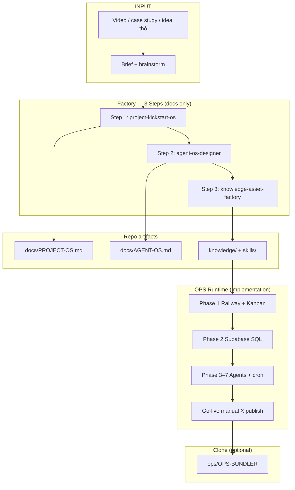

# Factory Workflow — End to end

Từ **ý tưởng / video YouTube** → **repo vận hành được** trên Railway + Supabase.

---

## Sơ đồ tổng

---

## Timeline thực tế (dự án mẫu)

| Giai đoạn | Thời gian ước tính | Output |
|-----------|-------------------|--------|
| Idea → brief | 2–4h | Brainstorm, link video, constraints |
| Step 1 Project OS | 1 ngày | `PROJECT-OS.md`, docs 01–05 |
| Step 2 Agent OS | 1 ngày | `AGENT-OS.md`, Kanban conventions |
| Step 3 Knowledge | 1–2 ngày | skills/, SOP, prompts, checklists |
| OPS Phase 1–2 | 0.5–1 ngày | Railway, Supabase live |
| OPS Phase 3–7 | 1–2 ngày | Pipeline + cron |
| Go-live | 0.5 ngày | Gateway, verify, đăng X thủ công |

---

## Quy trình từng bước

### Step 0 — Idea → Brief

→ [steps/00-idea-to-brief.md](steps/00-idea-to-brief.md)

- Xem video gốc, ghi chú architecture
- Brainstorm niche (vd. AI automation → forex/gold)
- Không code

### Step 1 — Project Kickstart OS

→ [steps/01-project-kickstart-os.md](steps/01-project-kickstart-os.md)  
Skill: **`project-kickstart-os`**

- 15 deliverables PROJECT-OS
- Folder structure, phases, milestones
- **Không** code, **không** prompts agent

### Step 2 — Agent OS Designer

→ [steps/02-agent-os-designer.md](steps/02-agent-os-designer.md)  
Skill: **`agent-os-designer`**

- 4 agent contracts
- Kanban workflow, scheduler, DB ownership
- **Không** code

### Step 3 — Knowledge Asset Factory

→ [steps/03-knowledge-asset-factory.md](steps/03-knowledge-asset-factory.md)  
Skill: **`knowledge-asset-factory`**

- Skills, SOP, prompts, checklists
- Cursor/Claude implementation prompts
- **Không** code runtime

### Step 4 — OPS Runtime

→ [steps/04-ops-runtime.md](steps/04-ops-runtime.md)  
Dùng: **[ops/OPS-BUNDLER.md](../ops/OPS-BUNDLER.md)**

- Railway, Telegram, Supabase
- TinyFish, pipeline, cron
- Verify scripts, manual publish

### Step 5 — Clone (dự án tiếp theo)

→ [ops/clone-checklist.md](../ops/clone-checklist.md)

---

## Gates (không nhảy bước)

| Gate | Điều kiện |
|------|-----------|
| G0 | Brief + link reference signed |
| G1 (M0) | PROJECT-OS 15 mục xong |
| G2 | AGENT-OS 4 agent + workflow |
| G3 | ASSET-INDEX đủ skills/SOP/prompts |
| G4 (M3) | Supabase 4 bảng live |
| G5 (M7) | Full pipeline completed |
| G6 (M8) | Weekly cron unattended |

---

## Anti-patterns

| Tránh | Làm thay |
|-------|----------|
| Code trước khi PROJECT-OS xong | Step 1 trước |
| Custom Celery queue | Hermes Kanban |
| Bot Telegram tạo schema | SQL Editor |
| Auto-post X v1 | Manual + export script |
| Skip `/data/.env` | Sync volume + Railway vars |

---

## Reference links (tutorial gốc)

- [Video Derek Cheung](https://www.youtube.com/watch?v=2oKmF--xJAI)
- [Hermes Agent](https://github.com/NousResearch/hermes-agent)
- [Hermes Kanban docs](https://hermes-agent.nousresearch.com/docs/user-guide/features/kanban)
- [Railway template](https://railway.com/deploy/hermes-agent)
- [Supabase plug](https://supabase.plug.dev/ykdVN09)
- [TinyFish](https://tinyfish.ai)
- [X Algorithm Phoenix](https://github.com/xai-org/x-algorithm)
